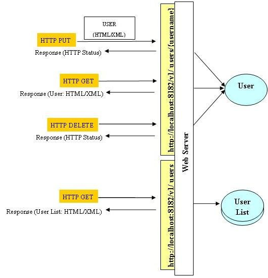
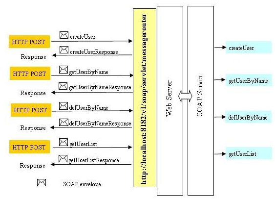
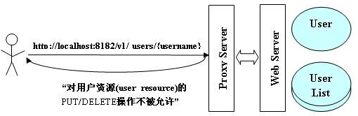
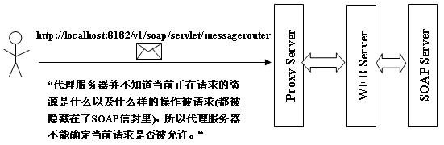

class: center, middle

# WEBSERVICE的设计方法 REST & SOAP
&nbsp;
&nbsp;

#### 钟业弘

主页: https://github.com/zhongyehong

---

## 报告内容

### 1. REST

### 2. SOAP

### 3. REST vs SOAP

---

## REST

### API

API即Application Programming Interface（应用程序编程接口）。

从实体的角度来说，API是一个软件组件或是一个 Web 服务与外界进行的交互的接口，是一些预先定义好的函数。

从概念的角度来说，API 是一套协议，规定了我们与外界的沟通方式：如何发送请求和接收响应。

API可分为系统级API，面向语言的API以及WEB API，本次报告讨论的主要是WEB API。

---
## REST

### 概念

REST是“REpresentational State Transfer”的缩写，可以翻译成“表现状态转换”。

其设计概念和准则为：

1.网络上的所有事物都可以被抽象为资源(resource)

2.每一个资源都有唯一的资源标识(resource identifier)，对资源的操作不会改变这些标识

3.所有的操作都是无状态的

---
## REST

### RESTful API

http://iwork.pku.edu.cn/workspace/add      —— 非RESTful

POST http://iwork.pku.edu.cn/workspace	   —— RESTful

1.URI是名词 -- workspace

2.用URI标识资源，用HTTP方法标识动作
	
&nbsp;&nbsp; POST -> Create

&nbsp;&nbsp; GET -> Retrieve

&nbsp;&nbsp; PUT -> Update

&nbsp;&nbsp; DELETE -> Delete

---
## REST

### REST架构风格的特点

1. 无状态：RESTful只要维护资源的状态，而不需要维护客户端的状态。对于它来说，每次请求都是全新的，它只需要针对本次请求作相应的操作，不需要将本次请求的相关信息记录下来以便用于后续来自相同客户端请求的处理。

2. C/S架构：通信只能由客户端单方面发起，表现为请求-响应的形式。

3. 安全性：GET方法应该是安全的，它们不会改变服务器端的资源状态，无论调用多少次该方法，效果都等同于没有调用

4. 幂等性：DELETE和PUT方法是幂等的，即无论调用多少次该方法，其效果都等同于调用一次，GET方法也是幂等方法

---
## SOAP

### 概念

SOAP是Simple Object Access Protocol的简称，即简单对象访问协议，是交换数据的一种协议规范。

<figure class="half">
 
 
</figure>

---
## SOAP

### 特点

1. SOAP使用XML编码，包括请求和响应

2. 它的请求和响应都被存放在SOAP封包里，终端（服务器或客户端）在收到SOAP封包后可以将其解析，从而获得消息。

3. 在使用HTTP协议来使用SOAP服务时，一般只使用POST方法。

---
## REST vs SOAP

接口抽象：

&nbsp;&nbsp; RESTful Web服务使用标准的HTTP方法(GET/PUT/POST/DELETE)来抽象所有Web系统的服务能力，但这种抽象并不一定适用于所有场景，但按照这种抽象设计的接口将更具有清晰的结构。

&nbsp;&nbsp; SOAP应用都通过定义自己个性化的接口方法来抽象Web服务，这更像我们经常谈到的RPC，这种抽象方法适用于所有场景，但不一定清晰。

应用场景：

&nbsp;&nbsp; REST是面向资源的。

&nbsp;&nbsp; SOAP是面向应用的。

协议绑定：

&nbsp;&nbsp; REST与HTTP协议相绑定，其操作依赖于HTTP协议的方法

&nbsp;&nbsp; SOAP可以与多种协议绑定，包括HTTP/TCP/UDP

---
## REST vs SOAP

### 实际场景

<figure class="half">
 
 
</figure>

---

## REST vs SOAP

### 代理

<figure class="half">
 
 
</figure>

---
## REST vs SOAP

### 总结

SOAP(Simple Object Access Protocol)是一个严格定义的信息交换协议，用于在Web Service中把远程调用和返回封装成机器可读的格式化数据。
事实上SOAP数据使用XML数据格式，定义了一整套复杂的标签，以描述调用的远程过程、参数、返回值和出错信息等等。而且随着需要的增长，又不得增加协议以支持安全性，这使SOAP变得异常庞大，背离了简单的初衷。

REST(REpresentational State Transfort)形式上应该表述为客户端通过申请资源来实现状态的转换，在这个角度系统可以看成一台虚拟的状态机。说到底，REST只是一种架构风格，而不是协议或标准。

两者本质上是两种web service的设计理念，各有利弊，需要针对具体问题具体分析。
---
