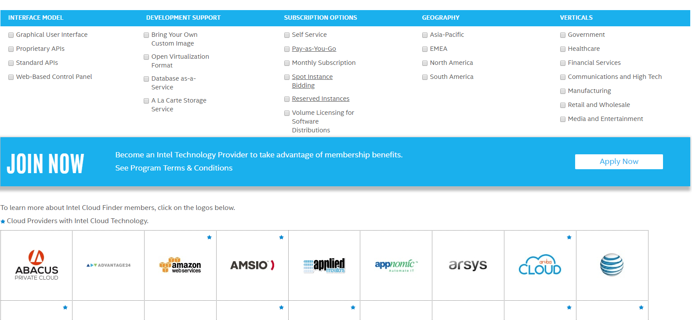
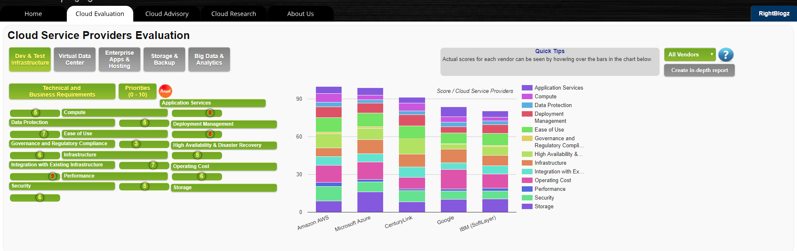
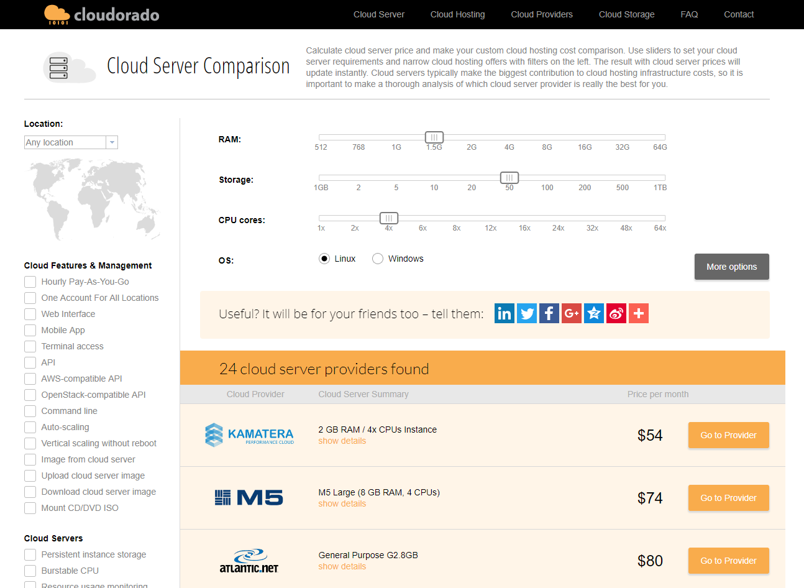
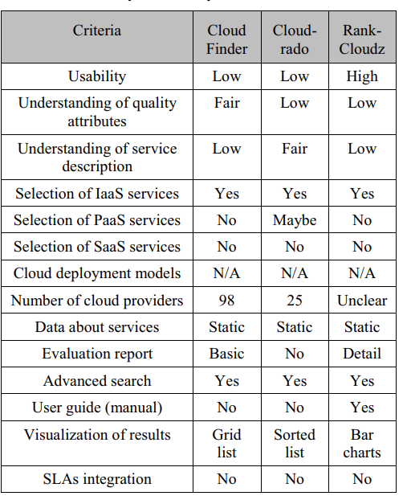
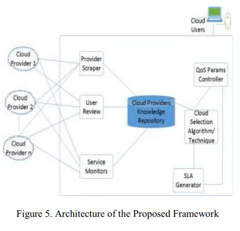

class: center, middle

# Trends and Directions in Cloud Service Selection
## 2016 IEEE Symposium on Service-Oriented System Engineering
## Mona Eisa, Muhammad Younas, Kashinath Basu, Hong Zhu
&nbsp;
&nbsp;

#### 钟业弘

主页: https://github.com/zhongyehong

---

## 报告内容

### 1. 简介

### 2. 云服务的特点

### 3. 现有云服务选择工具的比较

### 4. 论文提出的一种新架构

---

## 简介

随着云计算的发展，云厂商的数量越来越多，云服务的种类也越来越多，如何选择最佳的云服务对云用户来说是一项具有挑战性的任务。

云服务的选择过程涉及云服务的特性和模型、用户需求和知识、服务水平协议（SLA）等多种因素，如何为用户提供一个好的云服务选择工具，是一个值得探索的问题。

论文对云服务的特点进行分析，对现有云服务选择工具进行比较，进而提出了一个新的云服务选择的框架。

---
## 云服务的特点

Quality of Service：云服务有一系列的QoS指标，如可靠性，安全性，价格等等，用户和云商之间对QoS指标的关注重点不同，缺少一个标准的benchmark。

On-demand service provisioning：云服务应该以按需自助服务的方式自动提供，这意味着他们需要很少或根本不需要人工干预。

但能达到这个结果的前提是用户能正确地指定需求，并且需要对云服务的技术有深刻理解。

Elasticity：弹性是云的本质特征之一。

一方面，这允许消费者根据他们的需要无缝地获取或释放服务。另一方面，这使得提供商能够根据服务可用性和需求分配和解除资源分配。
然而，在云服务选择过程中引入弹性需要了解服务消费和供应的动态变化以及能够跟踪这种变化的工具。

Resource pooling and distribution：诸如CPU，内存，网络等资源由云商提供，用户可以透明地从云商获得这些资源，但这些透明性可能造成安全性和可靠性方面的隐患。

Service provisioning models: Saas，PaaS，IaaS

Service deployment models: 公有云，私有云，社区云，混合云

---
## 现有云服务选择工具的比较

目前有三个有名的云服务选择平台， Intel Cloud Finder, CLOUDORADO和RankCloudz

Intel Cloud Finder(https://www.intelcloudfinder.com): 这个平台会罗列云商，然后有许多配置项给你选择（如地域，按量付费，自定义镜像），根据你的选择刷新满足条件的云商。
该平台还有具体的搜索，用户可以选择自己注重的配置，给其重要程度设置优先级，然后平台会筛选云商并为其打分。

RankCloudz（http://rightcloudz.com）: 该平台将云服务分成5大类型，每个类型有许多参数，用户可以给这些参数设定优先级，然后平台会给云商打分

Cloudorado（https://www.cloudorado.com/）: 用户可以选择需求的具体的配置，如CPU，内存以及磁盘，还有一些特性，如是否支持API，是否支持下载镜像等等，然后平台会罗列满足条件的云商及对应的配置及价格，用户可以点击按钮进入该云商的页面。

---
## 现有云服务选择工具的比较

 
---
## 现有云服务选择工具的比较

需要注意的是，这三个工具的数据都是静态的，即不会每次用户查询的时候都向所有云商查询信息，而是预先将这些信息保存起来。

---

## 论文提出的一种新架构

---
## 论文提出的一种新架构

### Cloud Providers Knowledge Repository: 该架构基于一个云商的知识库

Provider Scrapper: 根据每个云商的API，定期地从不同的云商上抓取信息，如实时价格，新的服务等等，然后会根据这些信息更新知识库

User Reviews: 一个评价系统，用户可以参与云商的评价，其他用户也可以看到这些评价，从而进行参考

Service Monitors: 定期检查各个云商的服务可靠性，利用现有工具（CloudHarmony），但并非所有云商都提供接口

---
## 论文提出的一种新架构

QoS Parameters Controller: 该模块提供用户统一的QoS参数标准，使用户不需要太多的知识就能很好地选择

SLA Generator: 该模块会基于用户选择的QoS参数生成SLA，为了让用户能在选择云服务时了解关联的SLA

Cloud Service Selection: 该模块根据云商知识库及用户输入的QoS参数，根据某种算法为用户选择最匹配的云商和云服务

---
