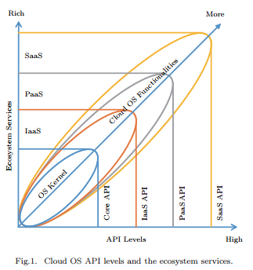
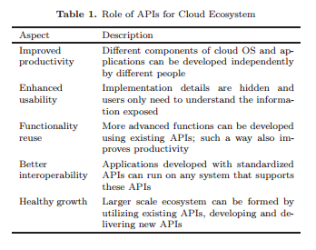
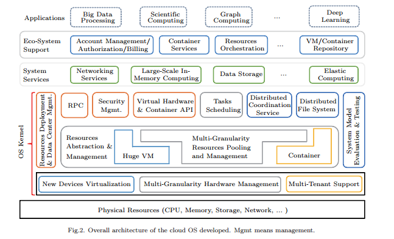

class: center, middle

# Evolution of Cloud Operating System: From Technology to Ecosystem

&nbsp;
&nbsp;

#### 钟业弘

主页: https://github.com/zhongyehong

---

## 报告内容

### 1. 云OS简介

### 2. 使能技术的演变(Enabling Technology Evolution)

### 3. 云OS体系的演变(Cloud OS Architecture Evolution)

### 4. 云生态的演变(Cloud Ecosystem Evolution)

### 5. 云OS API的抽象与API驱动的云OS实践(Methodology of Cloud OS API Abstraction, API-Driven Cloud OS Practice)

---

## 云OS简介

云OS是与传统的单机OS对应的概念，运行云应用的平台可以被称作云OS，它与单机OS有相似的地方：

&nbsp;&nbsp;它管理大规模的分布式的计算资源，类似于传统单机OS管理单机的硬件资源

&nbsp;&nbsp;它为运行用户应用提供了API，类似于传统单机OS提供的系统调用

&nbsp;&nbsp;单机OS通过文件系统提供存储API，而云OS通过分布式文件系统提供存储API

&nbsp;&nbsp;单机OS调度进程，云OS调度分布式作业

---

---

## 云OS简介

### 云OS的目标

云OS的发展来源于2个互相矛盾的目标：

&nbsp;&nbsp;提高性能，提高资源利用率

&nbsp;&nbsp;提供用户体验：提供更好的编程接口，更方便的管理工具和用户友好的界面

之所以称这2者是矛盾的，是因为提高用户体验会需要更方便的接口，而这会导致抽象层过多，因此会导致额外的开销从而降低性能;而暴露低层的API可以减少开销提高性能，但是这对开发者和用户来说十分不友好。

在平衡中逐步朝着这2个目标前进是云OS的发展动力。

---
## 使能技术的演变

### VM相关的技术与软件可伸缩性

VM一度被认为是云计算的象征，没有VM就没有云计算，通过VM，用户可以无需购买物理硬件即可部署它们的系统

VM的性能不是很好，与之相比，容器技术在性能上的表现更好, 但容器技术的隔离性不如VM，所以并不能完全取代VM

支持更高性能的云应用的两个手段：scale-up注重于提高单个机器的性能，scale-out注重提升多台机器的性能，单台机器的性能是有限的，所以在云环境下更注重的是scale-out，这就要求云OS具有可伸缩性。

云OS与单机OS不同，云OS必须管理集群中的数千台机器，或者管理数据中心中的多个集群，甚至管理全世界多个数据中心。所以云OS必须提供可伸缩的、有容错性的管理功能，以处理大量节点和故障，诸如机器故障，网络故障甚至是数据中心故障。

---
## 使能技术的演变

### 可编程性的演变

早期的云计算里，编程接口很少，大量的接口依赖于底层设施

使用现有的传统单机OS的API是不够的，云计算API需要设计以更好的支持云环境里的应用

早期云计算的API模仿了单机OS的API，如分布式文件系统API模仿单机文件系统，SQL API也和单机SQL的API一致

云计算应该提供应用层面的通用API接口：

&nbsp;&nbsp; 消息通信API进行消息收发

&nbsp;&nbsp; 分布式认证API进行用户识别和验证

&nbsp;&nbsp; 分布式日志API帮助开发者进行日志记录

---

## 云OS体系的演变

### 单机OS体系的演变

从宏内核到微内核的演变：

&nbsp;&nbsp;宏内核（如Unix）有单个命名空间及大量的二进制库用来管理文件、内存和进程，有性能高，结构复杂的特点

&nbsp;&nbsp;微内核（如QNX，一种嵌入式系统）只包含了必要的内容如隔离和进程通信，其他模块作为独立功能运行在内核之上，它具有更高的可拓展性和稳定性，但性能不如宏内核了。

虽然内核有别，但都支持POSIX，这使得应用跨平台运行成为可能。

随着CPU的多核和异构的出现，传统OS缺乏对异构核的支持，共享内存模型和基于同步互斥的缓存一致性协议限制了系统的可伸缩性。可以使用虚拟化技术来处理CPU异构。同时，虚拟化还可以增加应用程序的灵活度，降低管理成本，提高灾难恢复的能力。在大规模的系统维护中，带有底层操作系统的应用程序被打包在一个虚拟映像中。这是一种称为虚拟设备（virtual appliance）的软件交付的新形式。

---

## 云OS体系的演变

云OS致力于在操作系统层和应用层实现分布式的透明化（即看起来像是单机系统）：

&nbsp;&nbsp;在操作系统层中，分布式共享内存和进程迁移可以实现目标。

&nbsp;&nbsp;在应用程序层中，可以使用远程过程调用和内部进程消息通信来实现目标。

当前的云OS仅仅是简单的通过网络中间件将单机OS结合起来，如分布式据库，分布式存储和消息通信中间件，这些网络中间件用于隐藏底层的计算资源的分布。而底层则通过VM的热迁移实现透明化。但是VM同时也造成了大量的开销，降低了性能。

近年来容器技术的兴起，改善了云OS体系。但容器隔离性和安全性不好，所以将容器运行在VM里，但这会带来性能问题。这也是未来的一个机会和发展方向，考虑使用微内核或自定义内核来提高容器的隔离性（hyper）。

云操作系统应该垂直地集成单个节点操作系统和网络中间件，用于应用程序工作负载感知。在底层，可以使用虚拟化技术和容器来支持多核和异构处理器。微内核技术可以用来改善容器的隔离性和单一节点操作系统的灵活性。更高层次上，统一资源管理框架可以实现混合作业部署、全局调度优化的目标。

---
## 云生态的演变

### API的重要性

---
## 云生态的演变

### 分层的云架构

底层：虚拟层（计算资源虚拟化），包括VM，虚拟网络，虚拟存储以及容器技术。这一层的意义在于屏蔽底层物理资源的细节，向上层提供稳定的虚拟资源。

中层：服务支持层，这层的目的在于提供编程框架，以及进行任务调度：包括web应用，批处理任务和实时监控任务。

顶层：应用层，这层是用来服务终端用户。服务互联在云应用里十分重要，用于整合不同应用以提供新的高层应用服务，如用户认证和消息服务可以提供API给其他应用。

意义：建立良好的云架构抽象，使得各层相对独立，可以各自独立地进行演变，而不会过于影响整体。

---

## 云生态的演变

### 云技术采用的演变

云技术在早期难以使用，因为缺乏标准化的接口，即API。

后来随着云技术的发展，编程接口越来越成熟，开始出现成熟和稳定的API，包括基础设施管理，任务调度和一些关键的应用程序级编程接口，云技术也开始变得易用。

Hadoop和Openstack对云技术产生了很大的影响，前者实现了一组数据处理的基础设施，提高了大型集群的性能、可编程性和容错能力。后者提供了基础设施的虚拟化，包括计算、网络和存储。它们都对云技术的采用和推广有很大的作用。

在未来，云OS将对底层服务进行更多层的抽象。通过改进的编程接口和它们的实现，云技术将更方便地构建专门的云服务。当公有云服务无法满足开发者的需求，他们可以通过公共可用的云OS软件栈来构建内部云。

---
## 云OS API的抽象与API驱动的云OS实践

### API的演变

1.API抽象必须与当前的云实践兼容，因为很多应用程序都显示了当前云操作系统的有效性

2.Core API必须稳定，否则学习成本过高，兼容性也会变差，这有助于构建云生态系统

3.API应该分层并覆盖足够多的需求

4.API应该适应新的硬件，新的需求进行演变

其中Core API不应该与任何应用绑定，2种API应归类为Core API，一是与设施虚拟化相关的如VM，容器，虚拟网络和虚拟存储。二是与任务管理相关的如负载监控，不同粒度的任务调度。

---

## 云OS API的抽象与API驱动的云OS实践

### 5类Core API

容器相关API：包括创启停删，列举，监控，迁移

虚拟机相关API：更灵活有效地利用资源
	
调度相关API：提交任务，监控进程
	
存储相关API：存储内容，文件存储，对象存储，块存储
	
操作系统相关API：资源部署和管理，配置管理，系统监控，系统审计和安全管理

---
## 云OS API的抽象与API驱动的云OS实践

### 云OS架构

---
## 云OS API的抽象与API驱动的云OS实践

### 核心技术

容器技术：容器隔离技术，容器迁移技术
	
大型VM技术：如何做设备虚拟化，如何做多核和大量内存下的虚拟化，提升性能
	
任务调度技术：保障资源利用和服务质量，混合工作负载调度，可伸缩性，容错性，适应云环境下的典型计算框架
	
分布式文件系统技术：从伸缩性到可靠性，性能的提高
	
资源部署和数据中心管理技术：设计一个puppet-based cache-enabled的部署工具，监控系统运行时状态并设计一种基于深度学习的算法来识别和定位故障并进行安全评估
